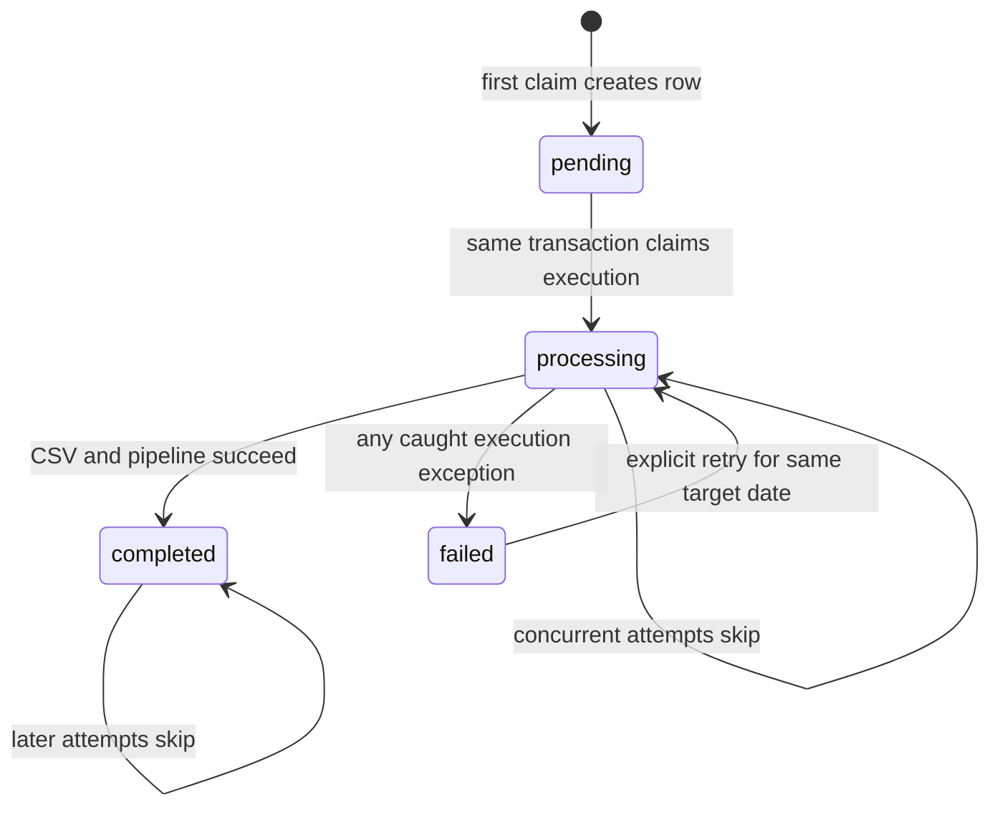

# CONTEXT — Nightly Telemetry Export and Pipeline Trigger

## Handoff status

Planning artifact only. No nightly-export implementation described here exists yet.

This file reconciles the incoming screenshot requirements with the repository as it exists on 2026-07-17. The implementation agent should use this file as the task contract and should prefer the adaptations below over literal screenshot names that do not exist in the workspace.

Implementation will touch `services/**`, which is a protected zone under root `AGENTS.md`. Obtain explicit developer confirmation before modifying those paths. Updating `memory-bank/progress.md` after implementation also requires explicit confirmation.

## Goal

Add an independent nightly worker that:

1. claims one execution for `nightly_export` and a UTC `target_date`;
2. writes an immutable CSV audit snapshot of that day's `telemetry_events` rows when the snapshot does not already exist;
3. invokes the existing Weekly Office & Programme Performance Prefect pipeline without involving the FastAPI main thread; and
4. records the wrapper job's terminal result in a new `job_runs` table.

The feature is an operational wrapper around the existing telemetry/reporting pipeline. It is not a replacement pipeline.

## Repository facts that govern the design

- Raw telemetry already persists in `telemetry_events` through `POST /telemetry/events`.
- The existing pipeline is `data/pipelines/pipeline.py`, with flow name `weekly_office_program_performance_flow`.
- Its source is `telemetry_events`; its sink is `weekly_office_program_performance`.
- Its durable run table is `telemetry_pipeline_runs`, not `pipeline_runs`.
- Existing pipeline statuses are `running`, `completed`, and `failed`.
- The pipeline loads weekly rows by replacement-style upsert on `(office, programme_id, week_start)`.
- SQL tables are SQLModel models registered in `services/api/app/core/database.py` and are created with `SQLModel.metadata.create_all`. The repository has no Alembic framework.
- Backend persistence modules live under `services/api/app/store/`; orchestration-specific service code may live under `services/api/app/services/`.
- Shared database configuration currently requires both `DATABASE_URL` and `JWT_SECRET_KEY`, even for a standalone database worker.
- The backend Docker service currently mounts only `services/api` at `/app`; it does not mount `data/` or `scripts/`. A scheduler must therefore run from a full repository checkout or a purpose-built worker image/container.
- Root `CONTEXT.md`, required by `AGENTS.md`, is currently missing. `memory-bank/CONTEXT-company.md` exists but is empty. This governance drift should be reported, not silently repaired as part of this task.

## Incoming requirements reconciled with current architecture

| Incoming requirement | Repository discrepancy | Authoritative adaptation |
| --- | --- | --- |
| Trigger `data.pipelines.telemetry_kpi_daily.run --no-prefect` or a Milestone 6 CLI | No `telemetry_kpi_daily` module or `--no-prefect` option exists. | Import and call `data.pipelines.pipeline.run_pipeline_window(...)`. Do not create a second KPI pipeline or bypass Prefect. |
| Trigger a pipeline for `target_date` | The implemented sink is weekly, and a one-day window would overwrite the weekly row with a partial-day aggregate. | Use `target_date` only for the daily snapshot and job idempotency. Invoke the existing pipeline with the full UTC ISO-week window containing `target_date`. |
| Keep `job_runs` separate from `pipeline_runs` | The implemented table is named `telemetry_pipeline_runs`. | Create `job_runs` separately and do not rename, merge, or extend `telemetry_pipeline_runs`. |
| `processing` provides a distributed lock | A non-unique lookup index plus check-then-insert is race-prone. | Add a uniqueness constraint on `(job_name, target_date)` in addition to the requested lookup index, and acquire the row transactionally. |
| Add a migration or SQL statements | No migration runner exists. | Add the SQLModel and register it for `create_all`; also add one idempotent PostgreSQL DDL file for production application. Do not introduce Alembic for this task. |
| Put `job_runner` in `services/` | Root `services/` is a multi-service boundary, while API persistence is under `services/api/app`. | Use `services/api/app/services/job_runner.py`, backed by `services/api/app/store/job_runs_store.py`. |
| No row remains `processing` after failure | Python exception handling cannot repair state after `kill -9`, host loss, or database unavailability. | Guarantee the transition for all caught `Exception` paths. Treat crash-stale rows as an explicit operational recovery case; leases/heartbeats are out of scope. |

## Responsibility boundary

| Concern | Owner | Durable record |
| --- | --- | --- |
| Nightly schedule, per-day claim, CSV snapshot, and pipeline invocation | `scripts/nightly_export.py` + `job_runner` | `job_runs` |
| Prefect task execution, records extracted/loaded, and flow errors | Existing `data/pipelines/pipeline.py` | `telemetry_pipeline_runs` |
| Raw immutable source events | Existing telemetry ingest/store | `telemetry_events` |
| Weekly business KPI output | Existing reporting store | `weekly_office_program_performance` |

Do not add foreign keys or copy all pipeline metadata into `job_runs`. The two run tables answer different operational questions and may be correlated by timestamps, target date/week, job name, and logs.

## Required implementation shape

### Files to create

- `services/api/app/models/job_runs.py`
- `services/api/app/store/job_runs_store.py`
- `services/api/app/services/__init__.py`
- `services/api/app/services/job_runner.py`
- `services/api/migrations/20260717_create_job_runs.sql`
- `scripts/nightly_export.py`
- `tests/test_job_runner.py`
- `tests/test_nightly_export.py`
- `docs/eval-traceability-nightly-export.md`

### Files to update

- `services/api/app/core/database.py` — register the model so local/test `create_all` creates the table.
- `.gitignore` — ignore runtime `data/raw/*.csv` while allowing an optional `data/raw/.gitkeep` or README.
- `data/pipelines/PIPELINE_DESIGN.md` — add only the independent scheduler decision and command; do not redesign the existing flow.
- `memory-bank/progress.md` — update only after implementation and only with explicit developer confirmation.

Do not modify `services/api/app/main.py` to schedule or import the nightly worker.

## `job_runs` data contract

Use the repository's SQLModel conventions and the default database schema used by the existing tables.

| Field | Type | Rules |
| --- | --- | --- |
| `id` | UUID string | Primary key; follow existing `_uuid_str` pattern. |
| `job_name` | string | Indexed; use constant `nightly_export`. |
| `target_date` | date | Required and interpreted in UTC. |
| `status` | string | `pending`, `processing`, `completed`, or `failed`. |
| `started_at` | timezone-aware datetime/null | Set when the claim enters `processing`. |
| `finished_at` | timezone-aware datetime/null | Set on `completed` or `failed`. |
| `error_message` | string/null | Concise exception text on failure; clear before an allowed retry. Do not store secrets. |
| `created_at` | timezone-aware datetime | Set once at insertion. |

Required database controls:

- unique constraint `uq_job_runs_job_name_target_date` on `(job_name, target_date)`;
- lookup index on `(job_name, target_date)` (the unique constraint may satisfy this physically on PostgreSQL, but name the intended lookup in the model/DDL clearly);
- status check constraint limiting values to the four allowed statuses; and
- an index on `status` only if query evidence justifies it; it is optional for this task.

The production DDL must be idempotent (`CREATE TABLE IF NOT EXISTS`, `CREATE [UNIQUE] INDEX IF NOT EXISTS`) and must match the SQLModel definition. The migration file is an auditable deployment artifact; application startup still uses the existing `create_all` path for missing-table creation in local and test environments.

## Job state machine and lock semantics



`pending` is a transient creation state. The first claimant must insert `pending` and transition it to `processing` in one database transaction so another process never treats `pending` as available work.

The lock must not be implemented as:

1. query for an existing row;
2. observe none; then
3. insert without a uniqueness constraint.

That sequence races across processes. Use the unique `(job_name, target_date)` key plus an insert/claim transaction. On conflict, reload the row:

- `completed` -> return a duplicate-completed outcome; caller logs and exits `0`;
- `processing` or transient `pending` -> return a lock-held outcome; caller logs and exits `0`;
- `failed` -> allow an explicit retry by atomically transitioning the same row back to `processing`, clearing `finished_at` and `error_message`, and refreshing `started_at`.

The public `job_runner` service contract must include behavior equivalent to:

- `acquire_job(job_name, target_date) -> acquisition result + JobRun`;
- `has_processing_lock(job_name, target_date) -> bool`;
- `has_completed_for_date(job_name, target_date) -> bool`;
- `mark_completed(job_run_id) -> JobRun`; and
- `mark_failed(job_run_id, error_message) -> JobRun`.

The store owns SQLModel queries/transactions. The service owns allowed transitions and acquisition outcomes. The script must not issue ad hoc `job_runs` SQL.

## Target-date semantics

- Read optional `TARGET_DATE` in strict `YYYY-MM-DD` format.
- If unset, use yesterday according to the UTC calendar, never server-local time.
- Invalid values must fail before acquiring a job row, log an actionable error, and exit non-zero.
- Daily source window for the CSV is `[target_date 00:00:00Z, target_date + 1 day 00:00:00Z)`.
- Pipeline source window is the complete UTC ISO week containing `target_date`: Monday `00:00:00Z` through the next Monday `00:00:00Z`.

The full-week pipeline window is mandatory. The existing loader replaces values at weekly grain, so passing a one-day window would corrupt a previously accumulated weekly row.

## CSV snapshot contract

Output path:

`data/raw/telemetry_YYYY-MM-DD.csv`

Rules:

- Query `telemetry_events` directly; the existing pipeline must continue to read the database, never this file.
- Include every persisted column in a deterministic order: `id`, `event_id`, `timestamp`, `event_type`, `service`, `session_id`, `user_id`, `request_id`, `schema_version`, `tags`.
- Sort rows by `timestamp`, then `id`.
- Serialize timestamps as UTC ISO-8601 and `tags` as stable JSON with sorted keys.
- Write a header-only file when the day has zero events.
- Create `data/raw/` when absent.
- If the final file already exists, do not open it for writing and do not change its bytes.
- Write to a temporary file in `data/raw/`, flush/close it, then publish it without overwriting an existing final file. Clean up the temporary file in `finally`.
- A pipeline failure after snapshot publication leaves the snapshot intact. A retry skips snapshot creation and retries only the remaining job execution.
- Runtime CSVs are local audit artifacts and must not be committed.

## Nightly script execution flow

`python scripts/nightly_export.py`

Required sequence:

1. Bootstrap repository and `services/api` import paths in the same style as `data/pipelines/pipeline.py`.
2. Resolve and validate `target_date`.
3. Initialize registered SQLModel tables through the existing database layer.
4. Acquire `job_runs` ownership for `nightly_export` and `target_date`.
5. Exit `0` with an INFO skip log if the row is already `processing`/`pending` or `completed`.
6. In one guarded `try` block, export the daily CSV if absent.
7. Calculate the containing ISO-week window.
8. Call `data.pipelines.pipeline.run_pipeline_window` with `trigger_mode="scheduled"`.
9. Require the returned pipeline status to be `completed`; otherwise raise an execution error.
10. Mark the job `completed`, set `finished_at`, log completion, and exit `0`.
11. On any caught `Exception`, mark the job `failed` with a concise error, log with `logger.exception`, and exit non-zero (or re-raise from a testable `run()` into a `main()` that returns `1`).
12. In `finally`, close sessions/resources and remove any unpublished temporary CSV. Do not use `finally` to overwrite an already terminal status.

The script must not call `POST /reporting/pipeline-runs`; direct use of the existing Python pipeline boundary keeps the worker independent from FastAPI and avoids requiring a JWT/API round trip.

## Environment contract

Required existing service environment:

- `DATABASE_URL`
- `JWT_SECRET_KEY` (currently required by the shared settings object even though this worker does not perform auth)

Optional new environment:

- `TARGET_DATE=YYYY-MM-DD`

Do not add a second database URL setting. The scheduler and API must use the same database.

## Scheduling decision

Production recommendation: OS cron on a UTC host or a dedicated scheduler container built from/mounting the full repository. Do not use APScheduler, FastAPI startup hooks, `@repeat_every`, or any in-process API scheduler.

Documented cron example:

```cron
CRON_TZ=UTC
15 2 * * * cd /opt/nexova && /opt/nexova/.venv/bin/python scripts/nightly_export.py >> /var/log/nexova/nightly_export.log 2>&1
```

This runs at 02:15 UTC and defaults to exporting/recomputing yesterday. The deployment must load the same secret environment used by the backend without placing secrets directly in the crontab.

If a scheduler container is chosen, add a distinct service/process. Do not add the cron command to the existing backend container's Uvicorn command, because reloads and replicas would create duplicate schedulers.

## Logging contract

Use structured key/value logging at INFO for start, snapshot-created/snapshot-exists, duplicate/lock skip, pipeline start, and completion; use ERROR with traceback for exceptions.

Every log record emitted by this script/service must contain:

- UTC timestamp;
- `job_name=nightly_export`;
- `target_date=YYYY-MM-DD`; and
- current or observed `status` (`pending`, `processing`, `completed`, or `failed`).

Do not introduce a database `skipped` status. A duplicate skip log reports the row's observed `completed` or `processing` status and adds an event/message such as `duplicate_completed` or `lock_held`.

## Reworked evaluation matrix

The incoming evaluation intent is retained, but names and date windows are aligned to the current architecture.

| ID | Acceptance criterion | Required evidence |
| --- | --- | --- |
| NE-01 | The nightly script is an independent process and is never imported, scheduled, or executed by `services/api/app/main.py`. | Import review plus `python scripts/nightly_export.py` smoke test. |
| NE-02 | `job_runs` supports `pending -> processing -> completed/failed`, records `target_date`, timestamps, and safe error text. | Model/store/service tests. |
| NE-03 | `job_runs` and existing `telemetry_pipeline_runs` coexist without shared columns, renames, or merged responsibilities. | Database metadata/model assertions. |
| NE-04 | Two concurrent claims for the same job/date produce exactly one owner; the other observes `processing`/`pending` and skips. | Deterministic concurrency test of `acquire_job`; documented two-process smoke command. |
| NE-05 | A completed job/date skips before CSV creation and before pipeline invocation. Checking only key existence is insufficient; status must be inspected. | Spy/mocked pipeline test and unchanged file hash. |
| NE-06 | A failed row can be explicitly retried; a caught exception always transitions the claimed row from `processing` to `failed`. | Failure injection and retry tests. |
| NE-07 | The CSV exists at the exact `data/raw/telemetry_YYYY-MM-DD.csv` path and contains exactly the target UTC day's database rows, including deterministic header/JSON output. | Seed rows immediately inside/outside boundaries and assert CSV. |
| NE-08 | An existing CSV is never overwritten, including when retrying a failed job. | Pre-create sentinel file and compare byte hash after run. |
| NE-09 | The pipeline invocation uses the existing `run_pipeline_window`, `trigger_mode=scheduled`, and the full ISO-week window containing `target_date`. | Mock call assertion plus regression test proving no one-day weekly overwrite. |
| NE-10 | Running twice for the same completed target produces one CSV and one new pipeline run at most. | End-to-end SQLite/test-DB execution and counts in both run tables. |
| NE-11 | INFO/ERROR logs contain UTC timestamp, job name, target date, and status for every relevant event. | `caplog` assertions. |
| NE-12 | `TARGET_DATE` accepts arbitrary valid dates without code changes; invalid format fails before creating a row. | Parameterized date parser/script tests. |
| NE-13 | The cron/scheduler decision and UTC expression are documented, with no API-main-thread scheduler. | `PIPELINE_DESIGN.md` and implementation PR notes. |
| NE-14 | `telemetry_events` remains immutable and the existing pipeline reads the database rather than the CSV. | Code review and existing pipeline tests. |

Concurrency verification should include both:

1. a deterministic automated service test that attempts two claims against the same database/key; and
2. a manual two-process smoke run against a disposable target date, confirming one terminal `job_runs` row and at most one additional `telemetry_pipeline_runs` row.

## Verification commands for the implementation agent

Run the focused Python checks first:

```text
pytest tests/test_job_runner.py tests/test_nightly_export.py tests/test_pipeline.py tests/test_reporting_api.py
```

Then run the repository's required quality gates applicable at handoff:

```text
npm run lint
npm run typecheck
npm test
```

Also verify directly:

```text
TARGET_DATE=2026-07-15 python scripts/nightly_export.py
```

On PowerShell, set `$env:TARGET_DATE = "2026-07-15"` before invoking Python.

## Non-goals

- No new daily KPI table or `telemetry_kpi_daily` pipeline.
- No changes to the existing KPI formulas, weekly reporting grain, or `/telemetry/report`.
- No loading from CSV into the pipeline.
- No merging or renaming of `telemetry_pipeline_runs`.
- No FastAPI scheduler.
- No Prefect Cloud deployment requirement.
- No automatic stale-lock lease, heartbeat, or crash recovery in this minimal phase.
- No backoffice UI for job status.
- No root `CONTEXT.md` or memory-bank repair without explicit developer approval.

## Handoff checklist

Before coding:

- obtain explicit confirmation for protected `services/**` changes;
- re-read root governance and confirm the missing `CONTEXT.md` discrepancy remains understood;
- confirm the working tree does not contain overlapping user edits.

Before delivery:

- satisfy NE-01 through NE-14 with explicit evidence;
- run the focused and repository quality checks;
- update `docs/eval-traceability-nightly-export.md`;
- request/obtain confirmation before updating `memory-bank/progress.md`; and
- document the selected production scheduler and how it receives secrets.

## Primary references

- `data/pipelines/PIPELINE_DESIGN.md`
- `data/pipelines/pipeline.py`
- `services/api/app/models/pipeline_runs.py`
- `services/api/app/store/pipeline_runs_store.py`
- `services/api/app/models/telemetry.py`
- `services/api/app/core/database.py`
- `services/api/domain/weekly_office_program_performance.py`
- `services/api/app/store/reporting_store.py`
- `tests/test_pipeline.py`
- `memory-bank/progress.md`
