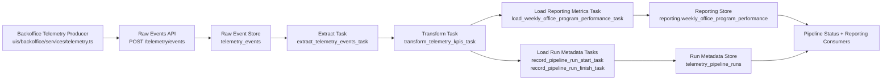

# Telemetry Pipeline Implementation Brief

## Purpose

This brief translates the telemetry pipeline requirements into the reality of the current Nexova monorepo. It is intended for the next implementation agent so they can build the required pipeline deliverables without re-auditing the repo from scratch.

This work should be treated as one larger telemetry and reporting project. Phase 1 is this planning/design brief, with a new phase 1A dedicated to aligning the telemetry contract before reporting and pipeline implementation begins.

## Phase Framing

The overall deliverable is split across four planned phases:

1. Planning and design phase:
   - define the full phase 1, phase 1A, phase 2, and phase 3 delivery plan
   - define explicit evaluation criteria for each phase
   - define architecture, boundaries, data targets, API contracts, and testing expectations
   - produce the definitive brief that downstream implementation agents will follow
1A. Telemetry contract and instrumentation alignment phase:
   - update the telemetry event catalogue to match Nexova's mandatory training/onboarding material metrics
   - instrument the required inbound, outbound, threshold, direct-edit, and cost-variance events
   - add the required `programme_id`, `currency`, and cost fields needed by the reporting pipeline
   - keep the existing immutable `telemetry_events` ingest/storage path as the raw source
2. Reporting implementation phase:
   - implement KPI calculations over the mandatory telemetry events
   - write business metric output to a reporting-owned table, not back into telemetry storage
   - expose reporting output through a new `services/reporting/` boundary
   - add tests and traceability for reporting behavior
3. Pipeline operationalization phase:
   - implement Prefect-based orchestration
   - add durable ETL execution metadata
   - add explicit idempotent load behavior
   - add manual trigger and status endpoints
   - complete the formal pipeline deliverables under `data/pipelines/`

This brief should therefore be read as the plan for the full project, with each phase having its own explicit evaluation criteria and implementation targets.

## Explicit Phase Evals

The next agent should treat the overall deliverable as separately evaluable planned phases. Each phase has explicit expectations.

### Phase 1 Eval: Planning And Design Brief

Phase 1 should be considered complete only if all of the following are true:

- the brief defines phase 1, phase 1A, phase 2, and phase 3 as one coordinated project
- each phase has explicit evaluation criteria
- the brief defines the expected architecture and phase boundaries
- the brief defines the intended telemetry entities, KPI targets, and pipeline scope
- the brief defines handoff expectations clearly enough for another agent to implement against it
- the brief defines or recommends concrete persistence, endpoint, idempotency, and testing expectations
- the brief makes non-goals explicit enough to prevent scope drift

Current phase 1 deliverable evidence:

- `data/pipelines/PIPELINE_IMPLEMENTATION_BRIEF.md`

### Phase 1A Eval: Telemetry Contract And Instrumentation Alignment

Phase 1A should be considered complete only if all of the following are true:

- `docs/telemetry/event-schemas.json` defines the mandatory Nexova material telemetry events:
  - `inbound_order_created`
  - `outbound_order_created`
  - `stock_threshold_triggered`
  - `direct_stock_edit_rejected`
  - `kit_cost_variance_detected`
- mandatory event properties are represented consistently:
  - `office`
  - `product_id`
  - `product_category`
  - `programme_id`
  - `quantity`
  - `currency`
- inbound events include a cost field required for material-cost reporting:
  - `unit_cost` or `total_cost`
- `product_category` uses Nexova's required values:
  - `training_kit`
  - `certification`
  - `onboarding_equipment`
- telemetry producers emit the new event names instead of relying on the older `procurement_*` and `assignment_*` vocabulary for the business metrics pipeline
- telemetry ingest continues to persist valid events into `telemetry_events`
- tests prove the new event names and required properties can be captured and stored
- no personal names for candidates, clients, consultants, or agents are added to telemetry `properties`
- `docs/telemetry/event-schemas.json` is updated as the canonical machine-readable event contract for the new material telemetry events
- `docs/telemetry/telemetry-plan.md` is revised or explicitly superseded so it no longer presents the older procurement/assignment KPI model as the active telemetry plan

Current workspace evidence and likely implementation anchors:

- `memory-bank/documentation/telemetry-CONTEXT.md`
- `docs/telemetry/telemetry-plan.md`
- `docs/telemetry/event-schemas.json`
- `uis/backoffice/services/telemetry.ts`
- `uis/backoffice/components/inventory/AssetEntryForm.tsx`
- `uis/backoffice/components/inventory/AssetExitForm.tsx`
- `services/api/app/routers/telemetry.py`
- `services/api/app/schemas/telemetry.py`
- `services/api/app/models/telemetry.py`
- `services/api/app/store/telemetry_store.py`
- `tests/test_telemetry_api.py`
- `tests/telemetry.test.ts`

Current gap:

- the workspace currently tracks an older asset/procurement/assignment vocabulary, including `procurement_order_created`, `assignment_order_created`, and `assignment_order_failed`
- the new mandatory context requires inbound/outbound material events, programme-level dimensions, currency, and cost fields
- inventory models and forms currently expose `asset_id`, `category`, `supplier`, `office`, and `quantity`, but do not yet model `programme_id`, `currency`, `unit_cost`, or `total_cost`
- `docs/telemetry/telemetry-plan.md` still documents the previous telemetry direction: `Asset assignment lead time`, `Stock-out frequency by asset category`, and `Procurement cycle time`
- `docs/telemetry/event-schemas.json` still contains the previous event catalogue and must be updated in the same phase as producer/test changes

### Phase 1A Documentation Update Requirements

The existing files under `docs/telemetry/` are part of the phase 1A deliverable and must be brought forward with the new telemetry contract.

Required updates to `docs/telemetry/telemetry-plan.md`:

- revise the scope so it describes Nexova training/onboarding material telemetry for the Weekly Office & Programme Performance Report
- clearly separate business-metric telemetry from support telemetry:
  - business-metric telemetry feeds the reporting pipeline and KPI outputs
  - support telemetry may remain useful for operational visibility but is not an input to the Weekly Office & Programme Performance Report
- replace the older KPI table with the mandatory KPI set:
  - Material Cost per Office/Programme
  - Kits Delivered
  - Shortage Frequency
  - Cost Variance Frequency
- update the approved-events section to center the mandatory event types:
  - `inbound_order_created`
  - `outbound_order_created`
  - `stock_threshold_triggered`
  - `direct_stock_edit_rejected`
  - `kit_cost_variance_detected`
- document required event properties: `office`, `product_id`, `product_category`, `programme_id`, `quantity`, and `currency`
- document inbound cost requirements: `unit_cost` or `total_cost`
- explain that old procurement/assignment event names may remain as historical/current-state implementation notes, but must not be presented as the active source events for the reporting pipeline
- keep the existing envelope, batching, storage, and PII constraints where they still apply

Required before/after telemetry mapping to document:

| Current / Older Telemetry | Phase 1A Required Telemetry | Treatment |
| --- | --- | --- |
| `procurement_order_created` | `inbound_order_created` | Replace for business-metric reporting; inbound material events must include cost context. |
| `assignment_order_created` | `outbound_order_created` | Replace for business-metric reporting; outbound material events drive kits delivered. |
| `stock_threshold_triggered` | `stock_threshold_triggered` | Keep event name, but update required properties to include `product_id`, `product_category`, `programme_id`, `quantity`, and `currency` where applicable. |
| `direct_stock_edit_rejected` | `direct_stock_edit_rejected` | Keep event name, but align properties with the new material telemetry contract. |
| none | `kit_cost_variance_detected` | Add as a new required business-metric event. |
| auth, session, list-view, filter, and other support events | support telemetry only | May remain, but must be clearly excluded from the reporting KPI input set. |

Required updates to `docs/telemetry/event-schemas.json`:

- add or replace the business-metric event schemas with the mandatory Nexova material event names
- include required properties and allowlists for every mandatory event
- model `product_category` with `training_kit`, `certification`, and `onboarding_equipment`
- model `office` as `valencia` or `miami`
- model `currency` as `EUR` or `USD`
- require `quantity` where the event measures volume
- require `unit_cost` or `total_cost` on `inbound_order_created`
- retain unrelated support telemetry only if it is clearly separated from the business-metric pipeline contract
- encode the before/after mapping above in the schema descriptions or adjacent documentation so future agents understand which older events were superseded versus retained

### Phase 2 Eval: Reporting Implementation

Phase 2 should be considered complete only if all of the following are true:

- backoffice telemetry producers emit approved event envelopes
- the API accepts telemetry batches through `POST /telemetry/events`
- telemetry events are validated against the shared schema
- raw telemetry is persisted in `telemetry_events`
- event names and payload allowlists are documented in `docs/telemetry/event-schemas.json`
- KPI calculations exist over the mandatory Nexova material telemetry event data
- KPI logic uses the persisted telemetry source rather than mock-only inputs
- reporting output is exposed through a new `services/reporting/` module
- KPI/report behavior is covered by tests
- telemetry traceability and KPI intent are documented
- `telemetry_events`, `services/telemetry/analysis.py`, and `GET /telemetry/report` are not modified for the reporting pipeline milestone

Current workspace evidence and likely implementation anchors:

- `uis/backoffice/services/telemetry.ts`
- `services/api/app/routers/telemetry.py`
- `services/api/app/schemas/telemetry.py`
- `services/api/app/models/telemetry.py`
- `services/api/app/store/telemetry_store.py`
- `tests/test_telemetry_api.py`
- `services/api/domain/telemetry_analysis.py`
- `tests/test_telemetry_report.py`
- `docs/eval-traceability-telemetry.md`

Planned KPI outputs for phase 2 should match the new context:

- Material Cost per Office/Programme
- Kits Delivered
- Shortage Frequency
- Cost Variance Frequency

Required reporting grain:

- one row per `office`, `programme_id`, and ISO `week_start`

Required reporting fields:

- `total_material_cost`
- `kits_delivered_count`
- `shortage_events_count`
- `cost_variance_events_count`
- `currency`

### Phase 3 Eval: Prefect Pipeline Operationalization

Phase 3 should be considered complete only if all of the following are true:

- `data/pipelines/PIPELINE_DESIGN.md` exists and describes the real telemetry pipeline design
- `data/pipelines/pipeline.py` exists and is executable as a CLI entrypoint
- Prefect `@flow` and `@task` boundaries are implemented for extraction, transformation, and load
- at least one external-service task has retries configured
- at least one optional task is invoked with `return_state=True`
- at least one transformation task uses Prefect caching
- load behavior is explicitly idempotent for re-runs over the same data window
- pipeline run metadata is durably recorded
- backend endpoints exist for latest run metadata and manual trigger
- backend endpoints import pipeline logic from `data/pipelines/` rather than duplicating it
- tests verify re-run safety, manual execution, and run metadata behavior

Phase 3 should be treated as the orchestration and operationalization layer that completes the full deliverable after phases 1, 1A, and 2 are implemented.

## Phase Summary

Phase 1 deliverable:

1. This brief itself, as the definitive planning and design artifact for the full phase 1, phase 1A, phase 2, and phase 3 project.

Downstream implementation deliverables:

1. Phase 1A telemetry contract updates for the mandatory Nexova material events and required KPI dimensions.
2. Phase 2 reporting tables, KPI calculations, and `services/reporting/` endpoints.
3. A Markdown design document at `data/pipelines/PIPELINE_DESIGN.md`.
4. A runnable pipeline script at `data/pipelines/pipeline.py` implemented with Prefect concepts:
   - at least one `@flow`
   - at least three `@task` stages
   - retries on external-service tasks
   - at least one optional task invoked with `return_state=True`
   - at least one transformation task using Prefect caching
   - idempotent load behavior
   - execution metadata persisted in a database or structured log
   - backend endpoints in `services/` that expose last-run metadata and manual trigger capability

The design and implementation must use real company entities, table names, event names, and KPIs rather than generic examples.

## Pipeline Purpose

This pipeline gives Nexova a weekly Office & Programme Performance Report by transforming raw training and onboarding material telemetry into reliable KPI outputs for material cost, kit delivery, shortage frequency, and cost variance analysis.

## Current Telemetry Source Of Truth

The workspace contains useful telemetry-related artifacts and patterns, but this brief should not assume the full telemetry deliverable is already implemented.

### Existing telemetry producers

- Backoffice producer: `uis/backoffice/services/telemetry.ts`
- Event catalog and allowlists: `docs/telemetry/event-schemas.json`

### Existing telemetry ingest and storage

- Ingest endpoint: `POST /telemetry/events`
- Report endpoint: `GET /telemetry/report`
- API router: `services/api/app/routers/telemetry.py`
- Event schema: `services/api/app/schemas/telemetry.py`
- Persistence model: `services/api/app/models/telemetry.py`
- Insert logic: `services/api/app/store/telemetry_store.py`

### Existing telemetry database table

- Table: `telemetry_events`
- Model: `TelemetryEventRecord`
- Core stored columns:
  - `event_id`
  - `timestamp`
  - `event_type`
  - `service`
  - `session_id`
  - `user_id`
  - `request_id`
  - `schema_version`
  - `tags` JSON/JSONB

### Existing KPI/report logic

- Pandas analysis module: `services/api/domain/telemetry_analysis.py`
- Current KPI outputs:
  - `assignments_per_day_by_office`
  - `assignment_failure_rate_per_day`
  - `auth_failure_rate`

### Requested telemetry additions from new context

- `inbound_order_created`
- `outbound_order_created`
- `stock_threshold_triggered`
- `direct_stock_edit_rejected`
- `kit_cost_variance_detected`

### Requested KPI outputs from new context

- Material Cost per Office/Programme
- Kits Delivered
- Shortage Frequency
- Cost Variance Frequency

### Existing validation and tests

- API ingest tests: `tests/test_telemetry_api.py`
- KPI/report tests: `tests/test_telemetry_report.py`
- Frontend telemetry producer tests: `tests/telemetry.test.ts`
- Traceability doc: `docs/eval-traceability-telemetry.md`

## Repo-Phase Inconsistencies

These are the main mismatches between the full project requirements and the current workspace state.

### 1. Telemetry business context is distributed across repo sources rather than a single dedicated pipeline context file

The actual telemetry business context lives across:

- `memory-bank/projectbrief.md`
- `memory-bank/techContext.md`
- `memory-bank/progress.md`
- `docs/telemetry/event-schemas.json`
- `docs/eval-traceability-telemetry.md`

Implementation consequence:
The next agent should treat the files above as the active telemetry source of truth for pipeline design and implementation.

### 2. The repo already stores telemetry events directly, not through an ETL pipeline

Current architecture is:

`backoffice telemetry producer -> POST /telemetry/events -> telemetry_events table -> GET /telemetry/report`

This means the repo already has capture, storage, and reporting, but no separate extraction/transformation/load pipeline job under `data/pipelines`.

Implementation consequence:
The project should define a clean path from telemetry production through ingest, reporting, and finally orchestration. If existing code is reused, it should be treated as implementation anchors, not proof that the full phase is already complete.

### 2A. Current telemetry vocabulary does not match the new mandatory Nexova material metrics

The existing telemetry catalogue and producers use older operational names such as:

- `procurement_order_created`
- `procurement_order_failed`
- `assignment_flow_started`
- `assignment_order_created`
- `assignment_order_failed`

The updated context requires material and programme telemetry names:

- `inbound_order_created`
- `outbound_order_created`
- `stock_threshold_triggered`
- `direct_stock_edit_rejected`
- `kit_cost_variance_detected`

Implementation consequence:
Phase 1A must update the telemetry catalogue, producers, and tests before the reporting pipeline is implemented. The pipeline should aggregate the mandatory context events, not the older assignment/procurement events.

### 2B. Current telemetry properties are missing programme, currency, and cost dimensions

The updated context requires:

- `programme_id`
- `currency`
- `unit_cost` or `total_cost` for inbound material cost reporting
- product categories aligned to `training_kit`, `certification`, and `onboarding_equipment`

The current inventory and telemetry flow mostly uses:

- `asset_id`
- `asset_category`
- `supplier` / `vendor`
- `office`
- `quantity`

Implementation consequence:
Phase 1A must add or map the missing dimensions before phase 2 reporting can compute material cost and weekly office/programme rollups.

### 3. `data/pipelines/` exists, but contains no telemetry pipeline artifacts yet

Current `data/pipelines/` only has README files.

Missing phase files:

- `data/pipelines/PIPELINE_DESIGN.md`
- `data/pipelines/pipeline.py`

Implementation consequence:
The next agent will need to create these from scratch.

### 4. Prefect is not currently wired into the repo

There is no current Prefect implementation and no confirmed Prefect dependency in:

- `services/api/requirements.txt`
- `requirements-dev.txt`
- `scripts/requirements.txt`

Implementation consequence:
The agent will need to decide where to add Prefect dependencies. The safest repo-aligned option is:

- add Prefect runtime dependency where the backend can import pipeline code, likely `services/api/requirements.txt`
- add any test/dev support only if needed in `requirements-dev.txt`

### 5. There is no current pipeline execution log or control table

The current phase requires run metadata such as:

- start time
- end time
- records processed
- status
- errors

The repo currently has no dedicated table or structured file for pipeline-run metadata.

Implementation consequence:
The next agent will need to introduce either:

- a new SQLModel table for pipeline runs, or
- a structured log file strategy

Given the existing SQLModel/Postgres telemetry storage pattern, a new database table is more consistent than a loose file log.

### 6. Current telemetry storage is immutable insert-only, not idempotent by pipeline design

`telemetry_store.bulk_insert_events()` inserts rows and commits. There is no documented control-table or upsert-based pipeline strategy for reprocessing windows.

Implementation consequence:
The load phase of the new pipeline must define idempotency explicitly. It cannot rely on the current ingest behavior alone.

### 7. Current report generation is request-time API computation, not scheduled ETL output

`GET /telemetry/report` computes KPIs from `telemetry_events` on request with a 60-second in-memory cache. That is useful, but it is not the same as a durable pipeline that tracks runs, retries, and load outcomes.

Implementation consequence:
The pipeline should likely materialize a derived table or tables rather than only wrapping the current report endpoint.

### 8. The current phase expects backend pipeline endpoints that do not exist yet

Required by this phase:

- one endpoint to return last pipeline run metadata
- one endpoint to manually trigger a run

Current repo only has telemetry ingest/report endpoints, not pipeline-control endpoints.

Implementation consequence:
The next agent needs to add new backend endpoints and ensure they import pipeline logic from `data/pipelines/` instead of reimplementing it in `services/api`.

### 9. Authentication posture needs a deliberate choice

Current telemetry endpoints are public:

- `POST /telemetry/events`
- `GET /telemetry/report`

But the current phase requires new backend endpoints to follow existing authentication conventions. In this repo, operational routes are generally JWT-protected.

Implementation consequence:
Pipeline trigger/status endpoints should likely be protected with the same JWT dependency pattern used on other operational API routes, even if raw telemetry ingest remains public.

### 10. The updated eval requires a `services/reporting/` boundary, while the current backend app lives in `services/api/`

Implementation consequence:
The next agent should create a reporting-specific module/boundary for the new reporting endpoints without modifying the existing telemetry router. If the FastAPI app remains the runtime entrypoint, wire that reporting boundary into `services/api` deliberately and document the chosen integration point.

## Recommended Interpretation Of The Pipeline

To stay aligned with the updated context, the pipeline should be framed as:

"A business reporting pipeline that extracts mandatory material telemetry from `telemetry_events`, transforms it into the Weekly Office & Programme Performance Report, and loads durable reporting rows plus run metadata for Laura and Elena."

This interpretation fits the overall project better than treating the work as only a narrow add-on to an already-finished telemetry system.

## Recommended ETL Boundaries

### Extraction

Source:

- table: `telemetry_events`
- access path: SQLModel/SQLAlchemy session used by `services/api`
- update pattern: append-only event rows arriving continuously from backoffice

### Transformation

Use the updated context KPIs as the starting point:

- total material cost per office/programme/week
- kits delivered per office/programme/week
- shortage events per office/programme/week
- cost variance events per office/programme/week

The transformation layer should not modify `services/api/domain/telemetry_analysis.py` or `GET /telemetry/report`; those are out of scope for the updated reporting milestone.

### Load

Recommended target:

- new reporting-owned table for business metrics
- plus a new pipeline run metadata table

Avoid loading back into `telemetry_events`. That table is the raw event source, not the analytical sink.

## Data Flow Diagram



Text flow:

1. Backoffice producers emit telemetry envelopes to `POST /telemetry/events`.
2. Valid events are stored in `telemetry_events`.
3. The pipeline extracts a source window from `telemetry_events`.
4. The transformation stage computes KPI rows for material cost, kits delivered, shortage frequency, and cost variance frequency.
5. The load stage writes summary rows to `reporting.weekly_office_program_performance` and execution metadata to `telemetry_pipeline_runs`.

## Recommended Idempotency Strategy

The next agent should choose one of these explicit approaches and document it in `PIPELINE_DESIGN.md`:

1. Windowed delete-and-rebuild for a bounded date range:
   - determine target date window
   - delete previously loaded summary rows for that same window
   - recalculate and insert the exact replacement rows

2. Upsert by natural summary key:
   - examples:
     - `(metric_name, date, office)` for office-segmented metrics
     - `(metric_name, date)` for global daily metrics

Recommended choice for this repo:

- Use upsert or delete-and-rebuild on summary tables.
- Keep `telemetry_events` immutable.
- Track each pipeline run in a dedicated run table.

Concrete second-run behavior after a load-phase failure:

1. A run begins for a bounded source window and records its `run_id` in `telemetry_pipeline_runs`.
2. If the load fails after some KPI rows were written, the next run for the same window must either:
   - delete all previously loaded reporting rows for that week and rewrite them completely, or
   - upsert rows by the natural key `(office, programme_id, week_start)`.
3. Because `telemetry_events` remains immutable, reruns only affect derived summary rows and run metadata, not raw events.
4. The final post-rerun state for `reporting.weekly_office_program_performance` must be identical regardless of whether the prior run failed midway.

## Recommended Run Metadata Fields

At minimum, persist:

- `run_id`
- `flow_name`
- `started_at`
- `ended_at`
- `status`
- `source_window_start`
- `source_window_end`
- `records_extracted`
- `records_loaded`
- `error_count`
- `error_summary`
- `trigger_mode` such as `manual` or `scheduled`

This aligns with the current phase requirements and is a better fit than a plain text log.

## Execution Log Specification

The execution log should be persisted in `telemetry_pipeline_runs` and must contain auditable fields with clear types and reasons for inclusion.

| Field | Data Type | Why It Is Needed |
| --- | --- | --- |
| `run_id` | `string` / UUID | Uniquely identifies a pipeline run for traceability across API, logs, and summary rows. |
| `flow_name` | `string` | Distinguishes which Prefect flow executed, especially if manual backfill and scheduled flows both exist. |
| `status` | `string` | Records whether the run is `running`, `completed`, or `failed` for operational monitoring. |
| `started_at` | `datetime` | Establishes when execution began for auditability and duration analysis. |
| `ended_at` | `datetime` | Establishes when execution finished and supports duration/error investigation. |
| `source_window_start` | `datetime` | Shows exactly which slice of `telemetry_events` the run was responsible for processing. |
| `source_window_end` | `datetime` | Complements `source_window_start` and prevents ambiguity about rerun scope. |
| `records_extracted` | `integer` | Confirms how many raw telemetry rows were read from `telemetry_events`. |
| `records_loaded` | `integer` | Confirms how many derived KPI rows were written to `reporting.weekly_office_program_performance`. |
| `error_count` | `integer` | Supports quick triage and distinguishes clean runs from partial/failing ones. |
| `error_summary` | `string` / nullable text | Preserves a concise description of what failed without requiring deep log inspection. |
| `trigger_mode` | `string` | Distinguishes scheduled runs from manual backfills or ad hoc API-triggered runs. |

## Proposed Persistence Design

To reduce ambiguity for the next agent, the project should use explicit target names for pipeline-owned outputs.

### Proposed run metadata table

- table name: `telemetry_pipeline_runs`

Recommended columns:

- `id`
- `run_id`
- `flow_name`
- `trigger_mode`
- `status`
- `source_window_start`
- `source_window_end`
- `started_at`
- `ended_at`
- `records_extracted`
- `records_loaded`
- `error_count`
- `error_summary`
- `created_at`

Recommended keys and constraints:

- unique key on `run_id`
- index on `started_at`
- index on `status`
- index on `(flow_name, started_at)`

### Proposed KPI summary table

- table name: `reporting.weekly_office_program_performance`

Recommended columns:

- `id`
- `office`
- `programme_id`
- `week_start`
- `total_material_cost`
- `kits_delivered_count`
- `shortage_events_count`
- `cost_variance_events_count`
- `currency`
- `computed_at`

Required uniqueness:

- unique key on `(office, programme_id, week_start)`

### Eval wording note: `reporting.business_metrics`

The updated phase 2 eval names `reporting.business_metrics`, while `memory-bank/documentation/data-pipeline-CONTEXT.md` specifies `reporting.weekly_office_program_performance`.

Recommended resolution:

- use `reporting.weekly_office_program_performance` as the business-specific table because it is fully defined in the context
- if strict eval wording is required, add a compatibility view or documented alias named `reporting.business_metrics`

### Deprecated earlier generic KPI summary proposal

The earlier generic `telemetry_kpi_daily` proposal is deprecated for this context. Do not implement it unless a later evaluator explicitly requires a compatibility artifact.

### Proposed KPI-to-key mapping

- Material Cost per Office/Programme -> `(office, programme_id, week_start)` via `total_material_cost`
- Kits Delivered -> `(office, programme_id, week_start)` via `kits_delivered_count`
- Shortage Frequency -> `(office, programme_id, week_start)` via `shortage_events_count`
- Cost Variance Frequency -> `(office, programme_id, week_start)` via `cost_variance_events_count`

## Recommended Prefect Mapping

### Flow candidates

At least two flows are easy to justify:

1. `telemetry_kpi_pipeline_flow`
2. `weekly_office_program_performance_flow`
3. `telemetry_kpi_manual_backfill_flow`

### Task candidates

Minimum three-task split:

1. `extract_telemetry_events_task`
2. `transform_telemetry_kpis_task`
3. `load_weekly_office_program_performance_task`

Optional/supporting tasks:

4. `record_pipeline_run_start_task`
5. `record_pipeline_run_finish_task`
6. `notify_pipeline_failure_task`

The optional notification task is a good place to satisfy the requirement for `return_state=True`.

## Backend Endpoint Guidance

New endpoints should likely live in a new telemetry-pipeline router under:

- `services/reporting/`

Recommended endpoints:

- `GET /reporting/weekly-office-program-performance`
- `GET /reporting/pipeline-runs/latest`
- `POST /reporting/pipeline-runs`

These should:

- import functions from `data/pipelines/pipeline.py`
- not duplicate ETL logic inside the router
- follow the API’s existing dependency and response conventions

Recommended auth posture:

- protect these endpoints with JWT auth

## Proposed Endpoint Contracts

The next agent should avoid inventing ad hoc response formats. The API contract should be explicit.

### `GET /reporting/weekly-office-program-performance`

Purpose:

- return the weekly office/programme KPI output for Laura and Elena

Recommended response:

```json
{
  "week_start": "2026-07-13",
  "entries": [
    {
      "office": "valencia",
      "programme_id": "b2b-sales",
      "total_material_cost": 1240.5,
      "kits_delivered_count": 18,
      "shortage_events_count": 1,
      "cost_variance_events_count": 0,
      "currency": "EUR"
    }
  ]
}
```

### `GET /reporting/pipeline-runs/latest`

Purpose:

- return the latest known pipeline run metadata

Recommended auth:

- JWT-protected

Recommended success response:

```json
{
  "data": {
    "run_id": "uuid",
    "flow_name": "telemetry_kpi_pipeline_flow",
    "trigger_mode": "manual",
    "status": "completed",
    "source_window_start": "2026-07-01T00:00:00Z",
    "source_window_end": "2026-07-02T00:00:00Z",
    "started_at": "2026-07-02T01:00:00Z",
    "ended_at": "2026-07-02T01:01:12Z",
    "records_extracted": 128,
    "records_loaded": 3,
    "error_count": 0,
    "error_summary": null
  }
}
```

Recommended empty-state response:

- `404` with a clear message such as `No pipeline runs found.`

### `POST /reporting/pipeline-runs`

Purpose:

- trigger a manual pipeline run

Recommended auth:

- JWT-protected

Recommended request body:

```json
{
  "trigger_mode": "manual",
  "source_window_start": "2026-07-01T00:00:00Z",
  "source_window_end": "2026-07-02T00:00:00Z"
}
```

Recommended trigger model:

- synchronous orchestration kickoff with immediate metadata response
- return created run metadata even if the flow continues beyond the request

Recommended success response:

```json
{
  "data": {
    "run_id": "uuid",
    "flow_name": "telemetry_kpi_pipeline_flow",
    "trigger_mode": "manual",
    "status": "running"
  }
}
```

Recommended conflict/error behavior:

- `409` if an equivalent run is already in progress for the same window
- `422` for invalid date windows
- `500` only for unexpected execution failures

Implementation requirement:

- these endpoints must import pipeline functions from `data/pipelines/pipeline.py`
- routers must not duplicate ETL logic

## Dependency And Packaging Guidance

Current Python dependency split is:

- app runtime: `services/api/requirements.txt`
- limited dev/test root support: `requirements-dev.txt`
- lightweight script requirement: `scripts/requirements.txt`

Because the backend must import the pipeline functions, Prefect should be available in the API runtime environment. That makes `services/api/requirements.txt` the most practical place for the core dependency.

## Concrete Deliverables For The Next Agent

The next agent should treat this brief as the plan for the full telemetry initiative across phase 1, phase 1A, phase 2, and phase 3. Existing code can be reused where appropriate, but the project should be evaluated as a larger end-to-end deliverable rather than assuming the earlier phases are already finished.

### Must create

- `data/pipelines/PIPELINE_DESIGN.md`
- `data/pipelines/pipeline.py`

### Likely must add

- one or more persistence models for pipeline run metadata and summary output
- reporting endpoints under `services/reporting/`
- updates to `docs/telemetry/telemetry-plan.md` that replace the old procurement/assignment KPI framing with the new material telemetry plan
- updates to `docs/telemetry/event-schemas.json` that define the mandatory phase 1A event names, properties, and allowlists
- tests covering:
  - successful manual run
  - idempotent re-run behavior
  - last-run metadata endpoint
  - any CLI entrypoint execution path

### Must reuse, not replace

- `telemetry_events` as read-only raw source
- `docs/telemetry/event-schemas.json` for event names and business semantics after phase 1A updates
- `services/api/domain/telemetry_analysis.py` and `GET /telemetry/report` as out-of-scope existing telemetry report surfaces that should remain untouched

## Minimum Acceptance Test Matrix

The next agent should treat the following as the minimum verifiable test set across the planned project phases.

### Phase 1 minimum tests

- the brief explicitly defines phase 1, phase 1A, phase 2, and phase 3
- the brief provides explicit evaluation criteria for each phase
- the brief defines architecture, persistence, endpoint, idempotency, and testing expectations
- the brief identifies non-goals and scope boundaries clearly enough to guide downstream implementation
- the brief is detailed enough that another agent can execute phases 2 and 3 without inventing the project structure from scratch

### Phase 1A minimum tests

- `docs/telemetry/event-schemas.json` includes all mandatory material event types
- `docs/telemetry/event-schemas.json` includes required properties and allowlists for those event types
- `docs/telemetry/telemetry-plan.md` describes the new material telemetry KPIs instead of presenting the old procurement/assignment KPIs as active
- telemetry ingest accepts valid batches
- new mandatory event names are accepted and stored
- required event properties are preserved in `telemetry_events.tags`
- inbound material events include `unit_cost` or `total_cost`
- direct personal names are not emitted in event properties

### Phase 2 minimum tests

- telemetry ingest rejects malformed envelope payloads correctly
- `Material Cost per Office/Programme` matches `inbound_order_created` cost aggregation
- `Kits Delivered` matches `outbound_order_created` aggregation
- `Shortage Frequency` matches `stock_threshold_triggered` aggregation
- `Cost Variance Frequency` matches `kit_cost_variance_detected` aggregation
- reporting output uses one row per `office`, `programme_id`, and `week_start`
- reporting output keeps Valencia `EUR` and Miami `USD` separate
- reporting endpoints return the expected response shape

### Phase 3 minimum tests

- `data/pipelines/pipeline.py` runs as a CLI entrypoint without import/runtime errors
- manual pipeline trigger endpoint creates a run and returns run metadata
- latest-run endpoint returns the most recent persisted run
- rerunning the same source window does not duplicate reporting rows
- failed or partial runs still persist execution metadata with status and error details
- Prefect retry behavior is configured on at least one external-service task
- at least one optional task is executed with `return_state=True`
- at least one transformation task has cache configuration present

### Verification expectation

The implementation should include both:

- automated tests for business behavior
- one documented run command for local verification of the pipeline flow

## Suggested Implementation Order

1. Complete and approve phase 1 by treating this brief as the definitive planning and design artifact for the full project.
2. Implement phase 1A telemetry alignment: update `docs/telemetry/telemetry-plan.md`, update `docs/telemetry/event-schemas.json`, then update producer instrumentation, required properties, and telemetry tests.
3. Implement phase 2 reporting work: metric calculations, reporting table, reporting endpoints, and reporting tests.
4. Create `data/pipelines/PIPELINE_DESIGN.md` so the phase 3 orchestration design is documented in an implementation-facing format.
5. Add Prefect dependency and any required backend runtime support for phase 3.
6. Introduce pipeline run metadata persistence and summary-target persistence as needed.
7. Implement `data/pipelines/pipeline.py` with Prefect flow/tasks and CLI entrypoint.
8. Add reporting endpoints that call into the pipeline module.
9. Add tests for phase 1A telemetry, phase 2 reporting behavior, and phase 3 run metadata/idempotency/manual trigger behavior.

## Practical Warnings

- Do not design the pipeline around generic telemetry examples. Use the mandatory Nexova material event names added during phase 1A, and keep `docs/telemetry/event-schemas.json` as the shared event contract after that update.
- Do not leave `docs/telemetry/telemetry-plan.md` describing the old procurement/assignment KPI model as the current telemetry plan after phase 1A.
- Do not create duplicate telemetry business logic inside API routers.
- Do not treat the current `GET /telemetry/report` response cache as pipeline state.
- Do not assume the root `README.md` is fully current; telemetry reality is better represented by the docs, tests, and `memory-bank` files listed above.
- Do not modify `services/api/domain/telemetry_analysis.py` or `GET /telemetry/report` for the updated reporting pipeline milestone.

## Non-Goals

To prevent project drift, the next agent should treat the following as out of scope unless explicitly expanded later:

- replacing the existing telemetry event envelope with a new schema
- rebuilding frontend telemetry capture from scratch when current producers can be reused
- duplicating KPI calculations independently in both routers and pipeline code
- loading transformed KPI outputs back into `telemetry_events`
- introducing unrelated generic pipeline abstractions that do not serve the current Nexova telemetry KPIs
- assuming a full Prefect deployment platform is required beyond what is needed for local execution, orchestration structure, and API-triggered runs
- converting currencies between Valencia and Miami in v1

## Primary References

- `docs/telemetry/event-schemas.json`
- `memory-bank/documentation/telemetry-CONTEXT.md`
- `memory-bank/documentation/data-pipeline-CONTEXT.md`
- `docs/eval-traceability-telemetry.md`
- `services/api/app/routers/telemetry.py`
- `services/api/app/models/telemetry.py`
- `services/api/app/store/telemetry_store.py`
- `services/api/domain/telemetry_analysis.py`
- `tests/test_telemetry_api.py`
- `tests/test_telemetry_report.py`
- `uis/backoffice/services/telemetry.ts`
- `memory-bank/techContext.md`
- `memory-bank/progress.md`
