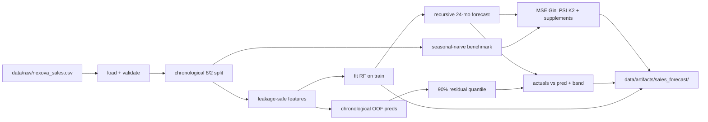

# Sales Forecasting Model Implementation Plan

> **Status:** Completed and archived under `memory-bank/past-implementations/`.

## Scope (locked)

Follow [`sales-forecasting-model-SPEC.md`](memory-bank/documentation/sales-forecasting-model-SPEC.md) exactly:

- Training script + domain library + metrics + chart + unit tests
- **Out of scope:** dashboard, API endpoints, scheduled jobs, synthetic data regeneration, XGBoost challenger

Store this plan under [`memory-bank/documentation/`](memory-bank/documentation/) during work; archive to `memory-bank/past-implementations/` when complete. Update [`memory-bank/progress.md`](memory-bank/progress.md) and [`project-structure.md`](project-structure.md) after delivery (protected-zone confirmation implied by this implementation request).

## Decisions already fixed by context

| Decision  | Choice                                                                                                                    |
| --------- | ------------------------------------------------------------------------------------------------------------------------- |
| Model     | `RandomForestRegressor` (300 trees, `max_depth=5`, `min_samples_leaf=3`, `max_features=0.8`, `random_state=42`)           |
| Split     | Train `2016-01`–`2023-12` (96 rows); test `2024-01`–`2025-12` (24 rows)                                                   |
| Features  | `time_index`, month sine/cosine, `revenue_lag_1`, `revenue_lag_12`, shifted rolling means 3/12                            |
| Leakage   | No contemporaneous `active_contracts` / `avg_contract_value_usd`; recursive forecast uses predictions, never test actuals |
| Benchmark | 12-month seasonal-naive from Dec 2023 cutoff (repeat last seasonal cycle for both test years)                             |
| Interval  | 90% split-conformal from chronological train OOF absolute residuals; clip lower bound > 0                                 |
| Deps      | Root `uv` / `pyproject.toml` — not Pipenv (`Pipfile` is empty and unused)                                                 |
| Runtime   | **Host `uv run`** (primary). Not part of the Compose `backend` / `ui` services for this milestone                         |

## Docker boundary (adjustments)

Compose today ([`docker-compose.yml`](docker-compose.yml)):

- `backend` mounts only `./services/api:/app` and a TinyDB volume — **not** repo-root `data/`, `scripts/`, or `tests/`
- Image installs [`services/api/requirements.txt`](services/api/requirements.txt) via pip ([`services/Dockerfile`](services/Dockerfile)); no sklearn/matplotlib
- Hot-reload bind mount would pick up a new `domain/sales_forecast.py` file, but importing it inside the API process would fail without ML deps

**Plan adjustments from that:**

1. **Do not train inside the `backend` container** and do not add a Compose training service this milestone (SPEC has no API/job). Primary commands stay host-side:
   - `uv run python scripts/train_sales_forecast.py`
   - `uv run pytest tests/pipelines/`
2. **Keep ML deps out of** `services/api/requirements.txt` so the API image stays lean and does not need rebuild for this feature.
3. **No FastAPI imports** of `sales_forecast` from `app/main.py` or routers — domain code may live under `services/api/domain/` for the same import path style as incident analysis, but it must remain script/test-only so the container never needs sklearn at startup.
4. **Resolve all I/O from repo root** (CSV → `data/raw/...`, artifacts → `data/artifacts/...`), not from `/app` API paths. CLI computes `ROOT_DIR` like [`scripts/analyze.py`](scripts/analyze.py).
5. **Matplotlib Agg backend** in plot code so chart generation works headless (CI / remote shells); Docker-friendly if a train service is added later.
6. **Explicit non-goals for Docker this milestone:** mounting `./data` into `backend`, baking the model into the image, or exposing forecast via `/reporting/*`. Document the host workflow in the training-script docstring / eval note so Docker users know where to run it.

Optional later (out of scope unless requested): a one-off Compose profile/`train` service with `uv` or a slim sklearn image, mounting `./data` + `./scripts` — not required for SPEC acceptance.

## Architecture

Mirror the existing incident-analysis pattern ([`scripts/analyze.py`](scripts/analyze.py) → [`services/api/domain/incident_analysis.py`](services/api/domain/incident_analysis.py)), with the Docker constraint that this domain module is **not** wired into the API:



### Module layout

| Path                                                                                                 | Role                                                                                                                           |
| ---------------------------------------------------------------------------------------------------- | ------------------------------------------------------------------------------------------------------------------------------ |
| [`services/api/domain/sales_forecast.py`](services/api/domain/sales_forecast.py)                     | All testable functions (load, validate, split, features, train, recursive forecast, benchmark, metrics, intervals, plot, save) |
| [`scripts/train_sales_forecast.py`](scripts/train_sales_forecast.py)                                 | Thin CLI: default paths, run pipeline, print finance summary + benchmark comparison                                            |
| [`tests/pipelines/test_sales_forecast_split.py`](tests/pipelines/test_sales_forecast_split.py)       | Required 8/2 split + leakage assertions                                                                                        |
| [`tests/pipelines/test_sales_forecast_features.py`](tests/pipelines/test_sales_forecast_features.py) | Schema, shifted rolls, recursive history uses preds                                                                            |
| [`tests/pipelines/test_sales_forecast_metrics.py`](tests/pipelines/test_sales_forecast_metrics.py)   | Gini perfect/reversed, PSI identical→~0, positive interval floor                                                               |
| `data/artifacts/sales_forecast/`                                                                     | Generated outputs (gitignored except `.gitkeep` / short README)                                                                |
| Root `pyproject.toml` + `uv.lock`                                                                    | `pandas`, `numpy`, `scikit-learn`, `scipy`, `matplotlib`, `joblib`, pytest as test dep                                         |

Do **not** add these ML deps to [`services/api/requirements.txt`](services/api/requirements.txt) (API Docker image stays lean; training is a host `uv run` workflow).

## Implementation steps

### 1. Branch and tooling

- Create feature branch from `main` (e.g. `feature/sales-forecast-model`).
- Verify `uv --version`; `uv init` at repo root if no `pyproject.toml` (confirmed absent).
- `uv add` runtime deps; `uv add --dev pytest`.
- Preserve unrelated worktree changes (untracked telemetry/docs/CSV already present).
- Add `data/artifacts/` to [`.gitignore`](.gitignore).
- Confirm Compose/`backend` image is unchanged (no Dockerfile or requirements.txt edits for this milestone).

### 2. Load, validate, split

Implement against real CSV ([`data/raw/nexova_sales.csv`](data/raw/nexova_sales.csv) — 120 consolidated rows, 2016-01 → 2025-12):

- Fail fast on missing columns, nulls, duplicates, gaps, out-of-range dates, non-positive revenue, row count ≠ 120, non-`consolidated` rows.
- Expose `split_train_test(df) -> (train, test)` with contract:
  - `train: month < 2024-01-01` (96), `test: month >= 2024-01-01` (24)
  - Disjoint months; `max(train) < min(test)`; exact boundary dates
- Row-count assertions apply to **raw validated split** before lag features drop early rows.

### 3. Feature engineering

Centralize `FEATURE_COLUMNS` schema/order:

- `time_index` (sequential month index from series start)
- Month encoding: **sine/cosine** of month-of-year (compact, cyclic; RF-friendly)
- `revenue_lag_1`, `revenue_lag_12`
- `revenue_rolling_mean_3` / `_12` with **shift(1)** so current target is excluded
- Exclude: raw `month`, `business_line`, current revenue, contemporaneous contract fields
- Document: no feature scaling (RF)

Shared builder used for both training matrix and recursive step feature construction.

### 4. Model, OOF validation, recursive forecast

- Fit final RF on all eligible training feature rows (after lag warmup).
- Chronological OOF predictions within train only (expanding/`TimeSeriesSplit`) for PSI bins and conformal residuals — **never** inspect test targets for calibration.
- Fixed-origin recursive forecast from Dec 2023 cutoff through Dec 2025:
  1. Build next-month features from history
  2. Predict
  3. Append **prediction** to history
  4. Repeat 24 times
- Guard/test: test actual `revenue_usd` never enters recursive history.
- No hyperparameter search against test; keep SPEC defaults unless a small train-only search is later requested.

### 5. Seasonal-naive benchmark

From Dec 2023 cutoff, map each test month to the corresponding month in the last observed seasonal cycle (2023 calendar year revenues), repeating that cycle for **both** 2024 and 2025 without reading 2024 actuals for 2025. Report MSE/RMSE/nRMSE/R² alongside RF.

### 6. Metrics and intervals

On the 24-row test set only:

| Metric              | Implementation note                                                                                                                           |
| ------------------- | --------------------------------------------------------------------------------------------------------------------------------------------- |
| MSE / RMSE / nRMSE% | `sklearn.metrics`; nRMSE = RMSE / mean(y_test) × 100                                                                                          |
| Normalized Gini     | `gini(y, pred) / gini(y, y)`; deterministic sort/ties                                                                                         |
| PSI                 | Bin edges from train OOF prediction quantiles; epsilon for empty bins; label stable/moderate/significant; `business_line_psi: not_applicable` |
| K²                  | `scipy.stats.normaltest(residuals)` → statistic + p-value                                                                                     |
| Supplements         | R², MAE, 90% coverage, mean interval width; optional `MSE / mean(y)²`                                                                         |

90% conformal: absolute OOF residual quantile → ± width around each RF point pred; clip lower bound to small positive constant.

Release rule (print in CLI summary): RF must beat seasonal-naive test RMSE to recommend dashboard use; otherwise report honestly.

### 7. Visualization and artifacts

Chart (`forecast_2024_2025.png`): actuals, RF preds, shaded 90% band, USD axis, month labels, legend/title highlighting Jan–Feb / August patterns. Set `matplotlib.use("Agg")` before pyplot import so rendering works without a display.

Persist under `data/artifacts/sales_forecast/`:

- `model.joblib`
- `metrics.json` (RF + benchmark + PSI interpretation + seed/params)
- `predictions.csv` (month, actual, pred, lower, upper)
- `run_metadata.json` (input path, split dates/counts, feature list, justification blurb)

### 8. CLI

```text
uv run python scripts/train_sales_forecast.py
```

Default input `data/raw/nexova_sales.csv`. Print concise validation summary, metric table, benchmark comparison verdict, and artifact paths. Docstring/comments explain each required metric and why low MSE alone is insufficient (per SPEC).

### 9. Tests

Minimum required + recommended focused tests under `tests/pipelines/`:

- Split 96/24, boundaries, disjoint, chronological, no test targets in training
- Validation rejects incomplete/gappy schema (small synthetic fixtures)
- Rolling features exclude current target
- Recursive history contains preds not actuals
- Determinism with `random_state=42`
- Gini / PSI / positive interval bounds

```text
uv run pytest tests/pipelines/
```

### 10. Governance / docs closeout

- Eval checklist evidence file: `docs/eval-traceability-sales-forecast.md` (map SPEC checklist → artifacts/tests; note host `uv` vs Docker API runtime)
- Update `memory-bank/progress.md` with architecture notes (including Docker non-coupling)
- Update `project-structure.md` for new domain module, script, tests, artifacts path
- Move this plan to `memory-bank/past-implementations/` when all steps are done
- Do not modify raw CSV or protected contexts beyond progress/structure/plan files
- Do not change `docker-compose.yml` / `services/Dockerfile` unless a follow-up explicitly adds a train service

## Acceptance gate

Ready for review when:

1. `uv run python scripts/train_sales_forecast.py` succeeds from a clean tooling setup (host; not via `docker compose`)
2. Pipeline tests pass
3. Artifacts include model, metrics JSON, predictions, chart with shaded interval
4. Metrics include MSE, PSI, normalized Gini, K² on test only
5. CLI states whether RF beat seasonal-naive RMSE
6. Raw dataset untouched; seed `42` persisted
7. Backend Docker image/requirements unchanged; API startup does not import sales-forecast ML code
